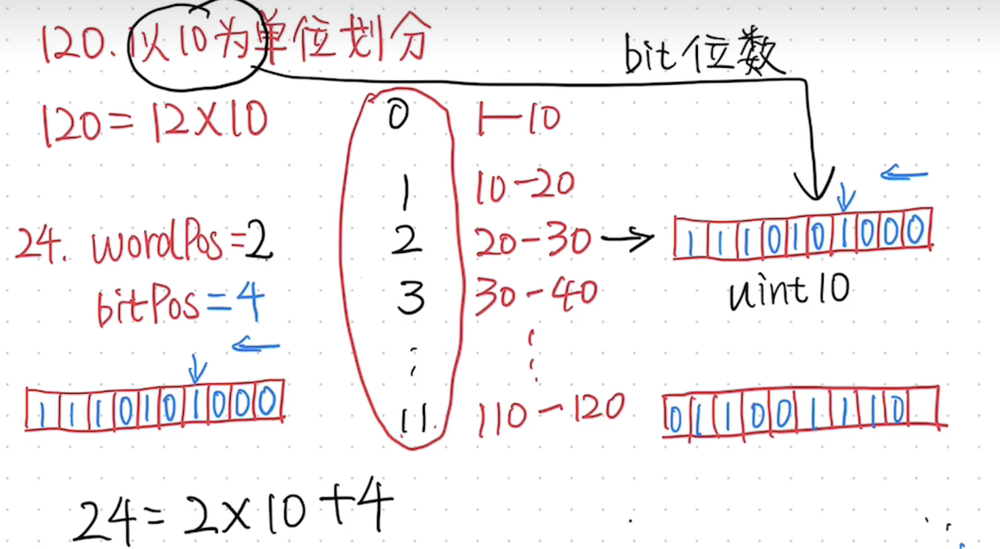
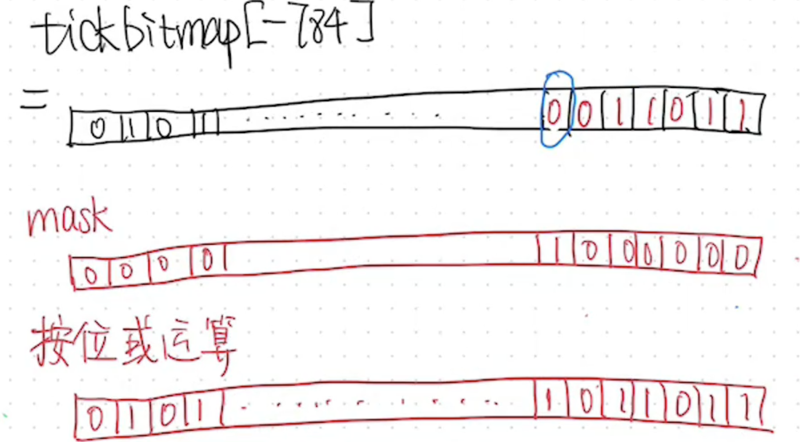
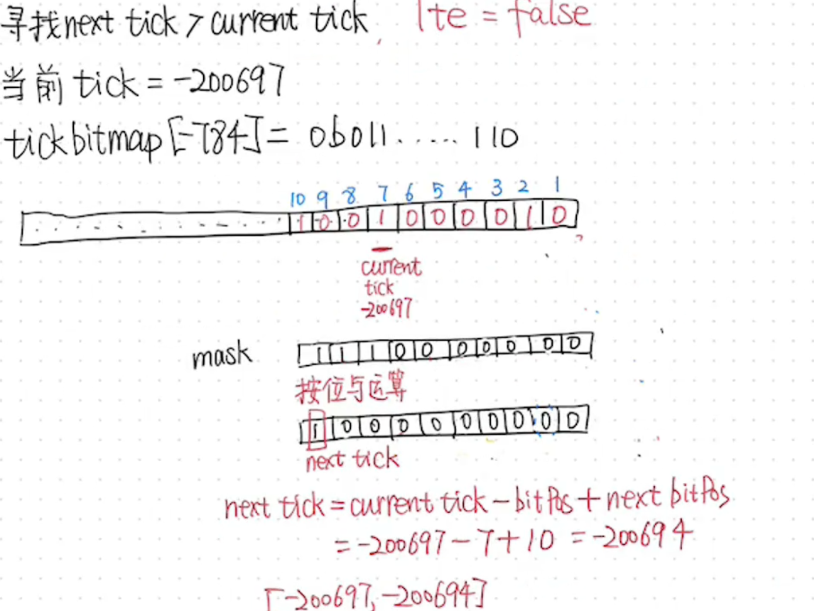
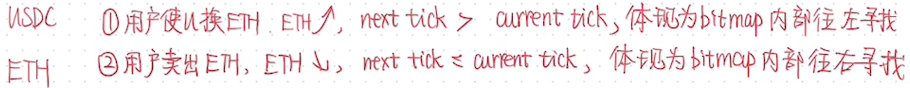
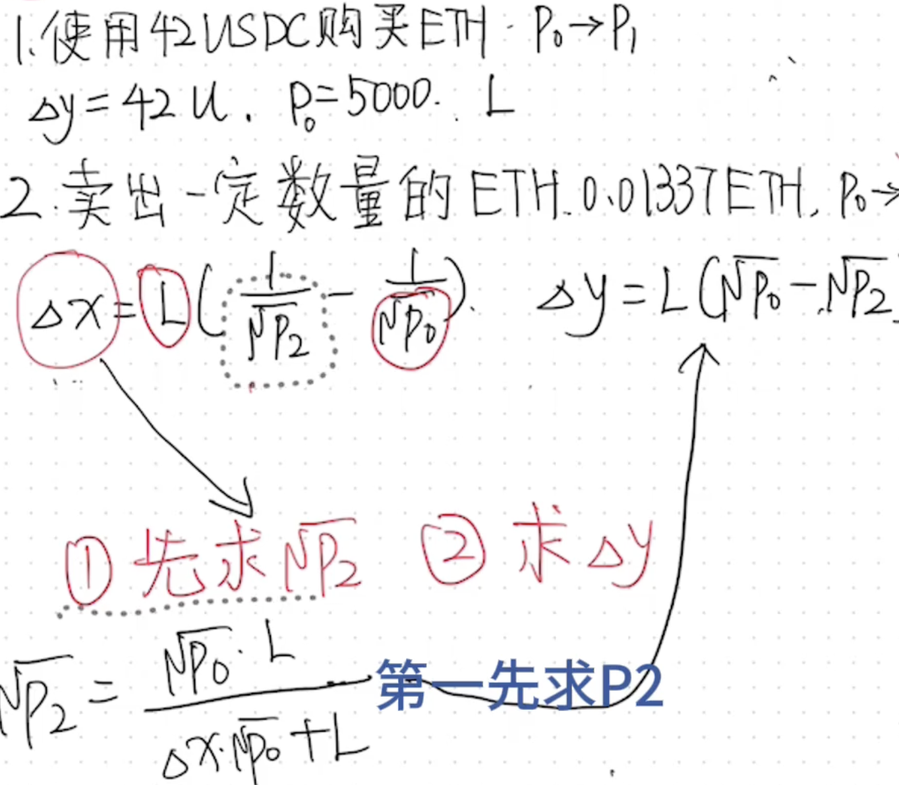
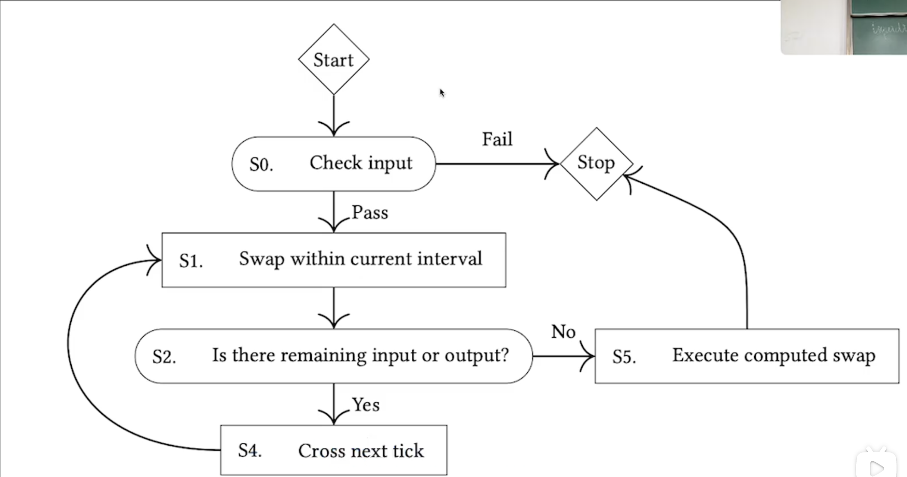
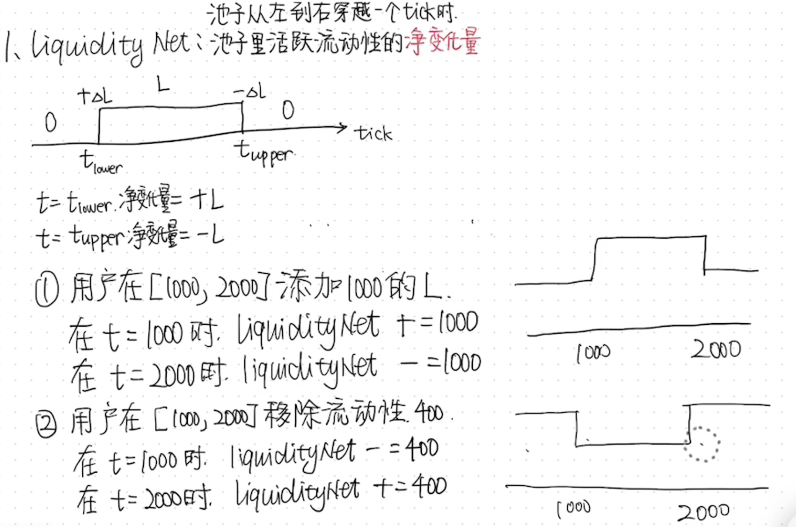
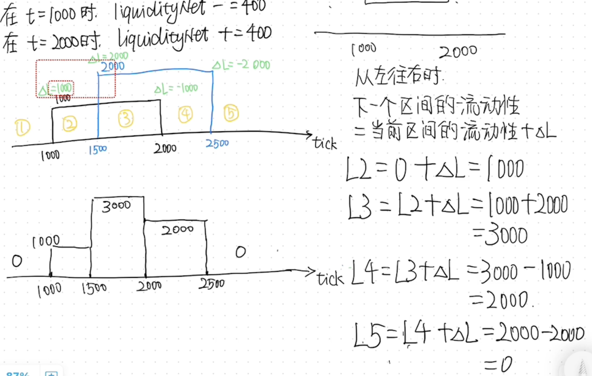
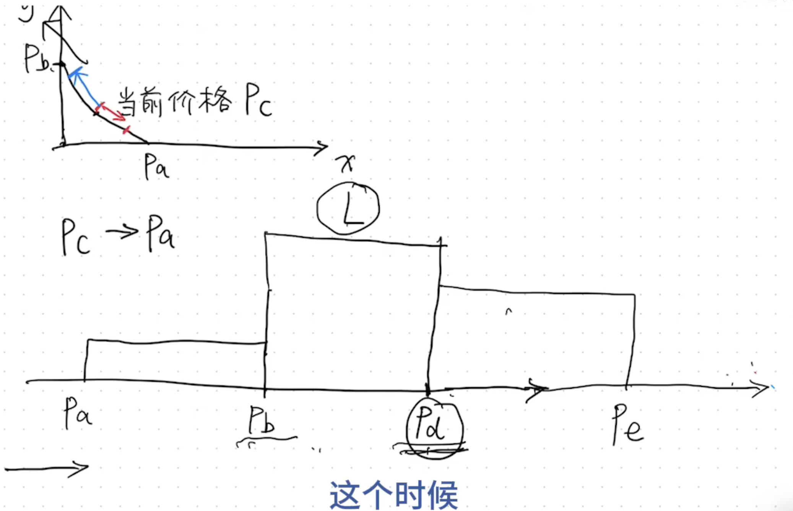

# Day 6 — Uniswap V3 Tick Bitmap & Cross-Tick Swap

做了 Hackenproof 新出的审计比赛，继续学习 Uniswap V3 的 tick 机制。

---

## Tick Bitmap 补充

昨天的 Day 4 已经介绍了 Tick Bitmap 的概念，今天深入存储和操作细节。

### 存储结构

Tick 值有很多个（从 `tickMin = -887272` 到 `tickMax = 887272`），V3 用映射的方式存储，而不是直接存每个 tick：

```solidity
mapping(int16 => uint256) public tickBitmap;
```

- **Key（`int16`）**：`wordPosition` — 把 tick 右移 8 位（除以 256），得到它属于哪个 word
- **Value（`uint256`）**：`bitmap` — 256 位的位图，每个 bit 对应一个 tick 是否活跃



### 活跃状态判断

- 对应 `bitPosition` 为 **1** → tick **不活跃**（没有流动性）
- 对应 `bitPosition` 为 **0** → tick **活跃**（有流动性）

如果要添加流动性，会在对应的 tick 进行检查：
- 如果 tick 不活跃，用**掩码**把对应的 bit 从 1 翻转为 0（表示这个 tick 现在有流动性了）
- 掩码操作：`tickBitmap[wordPosition] ^= (1 << bitPosition)`



---

## Bitmap 中寻找下一个 Tick

### 方向约定

Uniswap 中价格低位在右边，高位在左边（和数轴相反）：

```
低价格（右）←──────→ 高价格（左）
tick 小（右）←──────→ tick 大（左）
```

在一个 `wordPosition` 中：
- 找**下一个更小的 tick**（价格更低）→ 往**右**找
- 找**下一个更大的 tick**（价格更高）→ 往**左**找

### 寻址方式

同样使用掩码定位，以寻找**高位**下一个 tick 为例：

1. 确定当前 tick 的 `bitPosition`
2. 将当前 bit 及右侧所有位清零：`bitmap & ~((1 << (bitPosition + 1)) - 1)`
3. 用 `bitMostSignificantBit()` 找到剩余位中最右边的 1




### 为什么需要这个操作

这主要是为了高效计算**单区间内的 swap 值**：

- 用 token A 换 token B，已知 A 进来的数量
- P0 是当前价格，P1 是下一个 tick 的价格
- 在 P0 到 P1 之间，**流动性 L 是不变的**
- 如果 A 的数量在这个区间内就能换完 → 直接用恒定乘积公式算出换出的 B 数量
- 如果不够换 → 需要**跨 tick swap**，进入下一个区间继续




---

## Uniswap V3 LiquidityNet





每个 tick 上记录 `liquidityNet`：
- 添加流动性时，在 tick 的 `liquidityNet` 上累加（或减去）流动性数量
- `liquidityNet` 表示**跨过该 tick 时流动性的净变化**
- swap 过程中，每跨过一个 tick，当前流动性 `L += liquidityNet[tick]`

这样不需要遍历所有 LP position，只需要在每个 tick 边界更新一次流动性即可。

---

## Cross-Tick Swap

如果 P_a 和 P_b 之间的流动性不足以完成这次交换：

1. 先在当前区间内换，换到下一个 tick 边界
2. 跨过 tick → 更新流动性 `L += liquidityNet[tick]`
3. 检查剩余需要换的数量
4. 在新区间继续换
5. 重复以上过程，直到全部换完



### Gas 消耗

跨的 tick 越多，gas 越高。这也是为什么：
- 流动性浅的池子单笔 swap gas 可能很高（需要跨很多 tick）
- 池子深度足够时，大部分 swap 在单区间内完成，gas 较低

---

## Key Takeaways

1. **Tick Bitmap 用 `mapping(int16 => uint256)` 存储**，每个 word 管 256 个 tick，通过掩码操作快速查找
2. **Bit 为 0 表示活跃**（有流动性），翻转用 XOR 掩码
3. **找下一个 tick 的方向**：高位 tick 往左找（价格更高），低位 tick 往右找（价格更低）
4. **`liquidityNet`** 是每个 tick 上的流动性净变化量，跨 tick 时直接更新当前 L
5. **Cross-tick swap** = 在多个区间内逐步完成兑换，每个区间内流动性不变
6. **单区间 swap 最省 gas**，跨 tick 越多 gas 越高——这也是 V3 集中流动性提升资金效率的代价

---

*2026-05-23 | AI × Web3 School*
